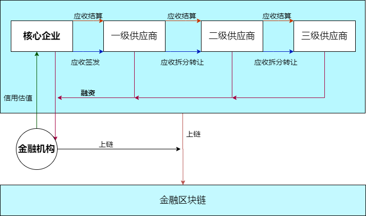

<center><h1>项目设计和功能测试报告</h1></center>
| 组号 |  姓名  |   学号   |   专业   |   分工   |
| :--: | :----: | :------: | :------: | :------: |
|  12  | 李金敏 | 18342050 | 软件工程 | 项目设计 |
|  12  | 赖培文 | 18342041 | 软件工程 | 功能测试 |
|  12  | 李赞辉 | 18342053 | 软件工程 | 功能测试 |

## 一、实验要求

### 1.1 总体要求

- 项目设计说明：根据提供的供应链场景，基于FISCO-BCOS设计相关的智能合约并详细解释智能合约是如何解决提出的问题。
- 功能测试文档：将智能合约部署至链上（单节点or多节点），并调用相关函数，详细说明上述的四个功能具体是如何实现的。

### 1.2 环境要求

- Linux Ubuntu 18.04.1
- FISCO-BCOS 2.7.0  

## 二、项目设计

### 2.1 问题分析

- 中小企业融资难
  - 传统的供应链金融交易信息不透明，银行准入条件比较高，商业汇票存在信用度低问题，导致核心企业信用传递难，下游中小型企业融资难 。
  - 缺乏可信的贸易场景，在供应链场景下，核心企业为可信的贸易背景，银行通常之服务核心企业及其一级供应商的融资需求，下游中小企业融资难
- 银行评估成本和风险高
  - 供应链上存在信息孤岛，银行需要对贷款公司进行详细的信用分析，以及公司财务能力分析，导致评估成本和风险较高。
  - 缺乏可信的贸易场景，银行需验证应收款单据的真实性，导致评估成本和风险较高。
- 履约风险无法有效控制
  - 供应商和核心企业、融资方、融资机构之间的支付和约定结算受限于各参与主体的契约精神和履约意愿，不确定因素较多，导致履约风险无法有效控制

### 2.2 合约设计

- 方案架构

  

- 存储设计

  - 金融机构，例如银行

    ```
    struct Bank{
    	address ad;//唯一标识
        string name;//银行名字
    }
    ```
    
    - 企业
  
      ```
      struct Company{
      	address ad;//唯一标识
          string name;//公司名字
          uint money;//公司账户余额
          uint creditValues;//信用额度
      }
      ```
  
    - 应收账款
  
      ```
      struct Receipt{
          uint id;//唯一标识
          address from;//欠款方
          address to;//收款方
          uint money;//金额
          uint start_date;//开始时间
          uint end_date;//还款时间
          bool isLoan;//是否用来贷款
          string info;//其他信息
      }
      ```
  
    - 存储到链上的数据
  
      - event 签发应收账款：包括发起和确认收到
      - event 应收账款转让
      - event 融资
      - event 应收账款到期结算
  
- 核心功能

  - 采购商品—签发应收账款，交易上链
    - 欠款方发起应收账款
      1. 检查消息发起者地址是否和Receipt中from一致，若不一致停止
      2. 加入Receipt
      3. 触发event 签发应收账款：已发起
    - 收款方签署应收账款
      1. 检查消息发起者地址是否和Receipt中to一致，若不一致停止
      2. 检查起始时间是否合法
      3. 触发event 签发应收账款：已签署
  - 应收账款的转让上链
    1. 检查链上的所有应收账款是否存在该转让应收账款，若无则停止
    2. 检查应收账款金额是否大于需要转让的金额，若不满足则停止
    3. 转让应收账款
    4. 触发event 应收账款转让
  - 利用应收账款向银行融资上链
    1. 检查是否是银行，若不是则停止
    2. 找到应收账款单据并检查是否有效，无效则停止
    3. 检查应收账款金额是否大于贷款的金额，若不满足则停止
    4. 触发event 融资
  - 应收账款支付结算上链
    1. 检查应收账款是否存在，若无则停止
    2. 检查欠款方和发起者是否一致，若不满足则停止
    3. 检查应收账款的金额是否大于等于还款金额，若不满足则停止
    4. 从应收账款的金额中减去还款金额，若不为0，则返回
    5. 删除该应收账款
    6. 触发event 应收账款到期结算

### 2.3 面向问题解释

- 解决中小企业融资难问题
  - 核心企业可以签发应收账款，然该应收账款可以部分转让给下一级企业，下游中小企业利用应收账款可直接向银行等金融机构融资，使得核心企业的信用逐级下传，解决了中小企业融资难问题。
- 解决银行评估成本和风险高问题
  - 银行向中下游企业融资时，无需再对该企业评估，只需要判断该企业所持有应收账款是否是来自核心企业的，根据核心企业的信用额度和还款能力即可评估风险，解决了银行评估成本和风险高问题。
- 解决履约风险无法有效控制问题
  - 目前还没写出到期自动还款部分，有待解决。

## 三、功能测试


## 四、实验总结

### 4.1 李金敏

​	本次实验我负责项目设计部分，和其他组员讨论以及参考一些区块链合约的资料之后，我们初定了整个合约的数据结构部分、实现的函数功能。

​	通过实验，我对solidity这门语言的了解可以说是入门了。在用solidity合约解决实际问题的过程中，我更加理解了课程上所学的一些区块链的一些知识，对区块链的底层以及应用部分有了深刻和清晰的认识。

### 4.2 赖培文


### 4.3 李赞辉


## 五、附录

### 5.1 参考材料

- http://fisco-bcos.org/zh/assets/docs/FISCO%20BCOS%20-%20Featured%20Cases-Cn.pdf
- https://www.hyperchain.cn/solutions/finance
- https://tech.antfin.com/solutions/digitalbank008
- https://baas.yizhangtong.com/example
- https://www.chainnode.com/post/322233
- http://www.caict.ac.cn/kxyj/qwfb/bps/201811/P020181101530141614382.pdf  